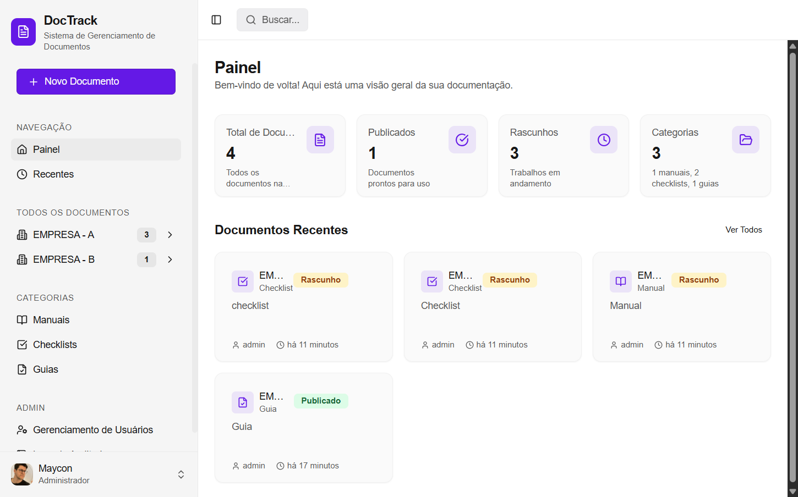
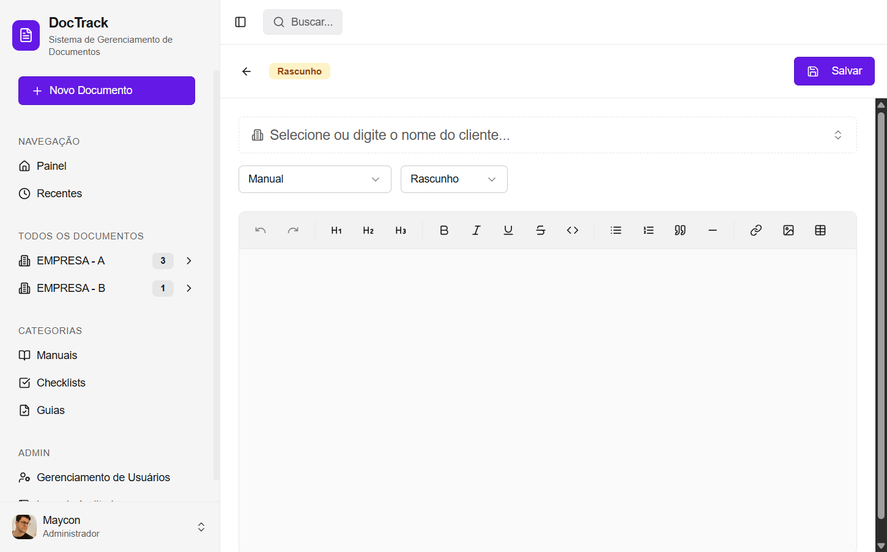

# DocTrack

<div align="center">


**A modern, enterprise-grade document management system**

[](https://www.typescriptlang.org/)
[](https://reactjs.org/)
[](https://nodejs.org/)
[](https://www.postgresql.org/)
[](https://tailwindcss.com/)

[Features](#-features) • [Tech Stack](#-tech-stack) • [Screenshots](#-screenshots) • [Author](#-author)

</div>

---

## 📋 Overview

DocTrack is a comprehensive document management solution designed for businesses that need to organize, track, and collaborate on documentation. Built with modern technologies and a focus on user experience, it provides a seamless workflow for document creation, versioning, and team collaboration.

## ✨ Features

### Document Management

- 📝 **Rich Text Editor** - Full-featured WYSIWYG editor with formatting tools
- 📂 **Smart Organization** - Categorize documents by type and client
- 🔄 **Version History** - Track all changes with complete revision history
- 🔍 **Version Comparison** - Visual diff between document versions

### Collaboration

- 💬 **Comments System** - Add contextual comments to documents
- 👥 **User Management** - Role-based access control (Admin, Editor, Reader)
- 📊 **Audit Logs** - Complete activity tracking for compliance

### User Experience

- 🌐 **Multi-language Support** - Available in English, Portuguese, and French
- 🎨 **Modern UI** - Clean, responsive interface built with shadcn/ui
- ⌨️ **Keyboard Shortcuts** - Command palette for power users (Ctrl+K)
- 📤 **PDF Export** - Export documents to PDF format

### Enterprise Ready

- 🔐 **Secure Authentication** - Session-based auth with Passport.js
- 🏢 **Client Management** - Organize documents by client/company
- 📈 **Dashboard Analytics** - Overview of document statistics

## 🛠 Tech Stack

<table>
<tr>
<td valign="top">

### Frontend

| Technology    | Purpose              |
| ------------- | -------------------- |
| React 18      | UI Framework         |
| TypeScript    | Type Safety          |
| Tailwind CSS  | Styling              |
| shadcn/ui     | Component Library    |
| TipTap        | Rich Text Editor     |
| Framer Motion | Animations           |
| React Query   | Data Fetching        |
| i18next       | Internationalization |

</td>
<td valign="top">

### Backend

| Technology  | Purpose          |
| ----------- | ---------------- |
| Node.js     | Runtime          |
| Express     | Web Framework    |
| Drizzle ORM | Database ORM     |
| PostgreSQL  | Database         |
| Passport.js | Authentication   |
| bcrypt      | Password Hashing |

</td>
</tr>
</table>

## 📸 Screenshots

### Dashboard

Modern dashboard with document statistics and recent activity.



### Document Editor

Full-featured rich text editor with client selection and category management.



## 📁 Project Structure

```
doctrack/
├── client/                 # Frontend React application
│   ├── src/
│   │   ├── components/     # Reusable UI components
│   │   ├── pages/          # Page components
│   │   ├── lib/            # Utilities and helpers
│   │   ├── locales/        # i18n translation files
│   │   └── hooks/          # Custom React hooks
├── server/                 # Backend Express application
│   ├── routes.ts           # API endpoints
│   ├── auth.ts             # Authentication logic
│   ├── storage.ts          # Data access layer
│   └── db.ts               # Database connection
├── shared/                 # Shared types and schemas
│   └── schema.ts           # Drizzle ORM schemas
└── package.json
```

## 👤 Author

<div align="center">

**Maycon Mancilha**

[](https://www.linkedin.com/in/mayconmancilha/)
[](https://github.com/mmancilha)

</div>

## 📄 License

Copyright © 2024 Maycon Mancilha. All rights reserved.

This software is proprietary and confidential. Unauthorized copying, modification, distribution, or use of this software, via any medium, is strictly prohibited without express written permission from the author.

For licensing inquiries, please contact via [LinkedIn](https://www.linkedin.com/in/mayconmancilha/).

---

<div align="center">

Made with ❤️ by [Maycon Mancilha](https://www.linkedin.com/in/mayconmancilha/)

</div>
